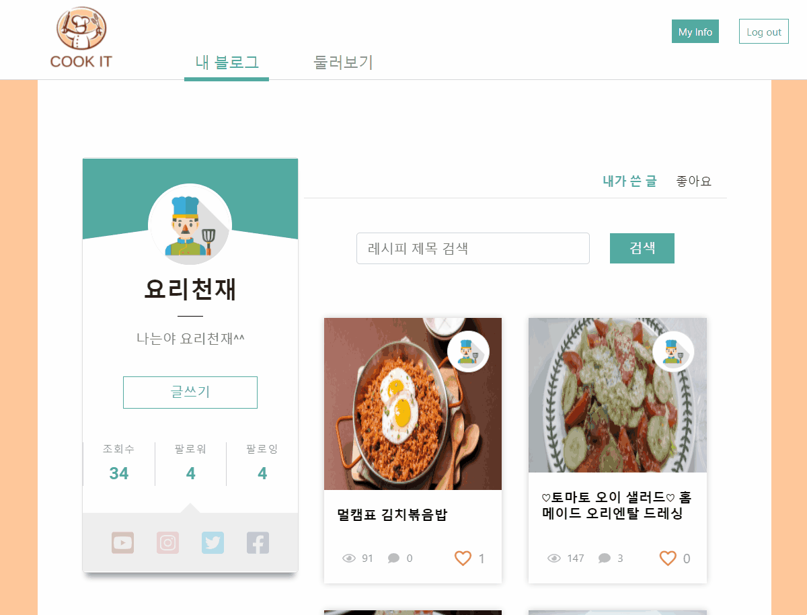

# SSAFY 3기 2반 공통 프로젝트

- **트랙?** Track 1. 웹 기술 - 개발자 블로그
- **기간?** 2020.07.08 ~ 2020.08.21 (총 7주)
- **팀원?** 곽은정(팀장) 김지윤 김태형 이건수 차보람

 

## 🥗 요리 블로그 CookIt 🥗

- 프로젝트 기능 명세서 [ [마크다운 ver.](notes/specification.md) ] [ [엑셀 ver.](notes/specification.xlsx) ]
- [To-do 리스트](notes/to-do.md)
- Front-end : [Mock-up](https://ovenapp.io/view/od8RcDZbTz2JoipOmIimfEljjwdyftTq/)
- Back-end : [ERD](https://www.erdcloud.com/d/JiWq5ZapHeiiuqMjw)
- [Git commit 메시지 및 merge request 규칙](notes/base-rule.md)

 

 

 

## 🥨 내 블로그

   

### 1. 내 레시피와 좋아요한 레시피 모아보기

  

  블로그의 메인 화면에서 내가 작성한 레시피 뿐만 아니라 좋아요한 레시피를 모아볼 수 있는 기능을 제공합니다.
  
   

### 2. 관심있는 유저를 팔로우 할 수 있는 기능

  

  
  레시피 뿐만 아니라 특정 유저를 팔로우하고 싶다면 팔로우할 수도 있습니다.
  
   

### 3. 글쓰기 시 재료 입력 자동 완성

  

  
  COOKIT의 메인 기능 중 하나입니다. COOKIT에는 1400개가 넘는 정제된 재료명 데이터가 있습니다. 특히 재료는 대분류, 중분류, 소분류로 나뉘어져 있는데 자동 완성에서는 소분류의 입력만 지원합니다. 단순하게 가나다 순으로 정렬 되는 것이 아닌 적절한 정렬 방법을 도입해서 사용자가 최대한 빠르게 원하는 재료를 입력할 수 있도록 알고리즘을 구현했습니다. 목록에 없는 재료를 입력할 경우 입력되지 않습니다.
  
   

## 🍰 둘러보기

   

### 1. 카테고리별, 제목 및 태그, 최신순, 조회순, 추천순으로 다양하게 검색

  

   

### 2. 재료 필터링으로 원하는 레시피를 보다 쉽고 편하게 검색 가능

  

  
  COOKIT의 메인 기능 중 하나입니다. 앞서 말했듯이, 1400개가 넘는 재료 데이터가 정제되어 있고, 레시피를 작성할 때 재료를 입력하기 때문에 찾고 싶은 레시피를 재료에 따라 쉽게 필터링해서 검색할 수 있습니다. 예를 들어, 다른 레시피 사이트에서 김치찌개를 검색하면 돼지고기, 참치, 스팸 등 재료에 구분없이 김치찌개가 모두 나오지만, 특별히 돼지고기 김치찌개를 먹고 싶다면 COOKIT에서 포함할 재료에 `돼지고기`를 입력해서 검색하면 됩니다. 그 외, 알러지가 있는 사람이나 남은 재료를 빨리 사용해야하는 1인 가구 등 다양한 환경에서 편리하게 검색할 수 있습니다.

   

### 3. 나중에 보고 싶은 레시피에 좋아요 누르기

  

  
  좋아요는 해당 레시피에 대한 추천의 의미이자, 스크랩의 의미라고 할 수 있습니다. 

 

## 🍤 레시피 뷰어

   

### 1. 시간 부분 자동 인식되는 타이머

  

  
  COOKIT의 또 다른 메인 기능입니다. 작성자가 레시피에 xx분, xx초, xx~xx분 등 시간을 작성하면 해당 부분을 인식합니다. 시간 부분을 클릭하면 바로 타이머가 시작됩니다. 타이머는 00:00초일 때 종료음을 송출합니다.

   

### 2. 가로보기에서 자동으로 음성 인식 활성화

  

  
  오른쪽 아래의 가로보기를 누르면 읽기모드 창이 나타납니다. 읽기모드에서는 각 단계별로 페이지를 넘겨서 볼 수 있습니다. 가로보기를 누르면 음성인식이 자동으로 활성화 됩니다. 음성인식 명령으로 다음, 이전, 닫기, 타이머 등을 수행할 수 있습니다.

 

 

## 🌮 기대효과

 

## 🍩 일정

 

## 🍭 기술 스택 및 담당

- Front-end : 곽은정 김태형 차보람
- Back-end : 김지윤 이건수

 

## 🙄 프로젝트를 진행하며 힘들었던 점, 느낀 점

1. Vue.js를 .html 단위로 문법 위주의 공부를 해본 적은 있지만, 이렇게 큰 단위로 project를 생성해서 해본 것은 처음이라 초반에 컴포넌트나 뷰 사이의 관계에 대해서 많이 헷갈렸다. 특히 .html 파일 단위에서는 많이 신경쓰지 않았던 props나 event를 많이 써야했다. 개념적으로 배우는 것보다 실제 프로젝트에 적용해보니 이해가 훨씬 쉬운 것 같다.
2. 레시피 사이트의 특성상 이미지를 처리해야하는 일이 많았는데 프론트엔드에서 신경써야할 부분이 더 있어서 좀 어려웠다. 사진을 다른 정보들과 묶어서 `FormData`로 보낸다든지, 레시피 작성에서는 업로드한 이미지만 썸네일로 보여주면 됐는데, 레시피 수정에서는 이전에 사진을 올렸을 수도 있고 아닐 수도 있기 때문에 그 부분을 다르게 처리해줘야 한다든지.. 해결이 어렵지는 않았지만 '아 이런 것도 생각해야겠구나..'라는 생각이 들었다.
3. 처음에는 개발 위주로 진행하다가 마지막 일주일동안 웹 디자인에 내 영혼을 갈아넣었는데 결과물을 보니 확실히 보기 좋은 떡이 먹기도 좋다(?)는 생각이 들었다. ㅋㅋㅋ 주변에서 디자인 관련 칭찬도 많이 들어서 뿌듯했다. 덕분에 Bootstrap이랑 Vuetify는 통달했고 Codepen을 편하게 쓸 수 있게 되었다. 특히 CSS만으로 동적인 디자인을 하기엔 엄청 힘들다는 것을 뻐저리게 느껴서 나중에 시간이 된다면 Less나 Scss도 배워보고 싶다.
4. 비록 순위권에 들지는 못했지만 결과적으로 처음 생각했던 기능 대부분을 구현할 수 있어서 만족스러웠다. 7주 동안 고생하면서 만든 사이트다보니 나는 내 웹페이지의 기능을 모두 꿰고 있었는데, 주변에서 피드백을 받아보니 그냥 레시피 사이트구나~ 정도만 생각하고 어떤 기능이 있는지는 잘 모르는 것 같았다. 메인 기능을 완벽하게 만들어놓고도 유저의 접근성을 많이 살리지 못한 게 아쉬웠다. 그 부분을 조금 더 살렸다면 순위권에 들 수도 있지 않았을까 생각한다.
